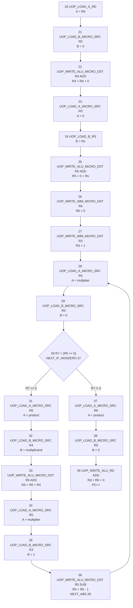
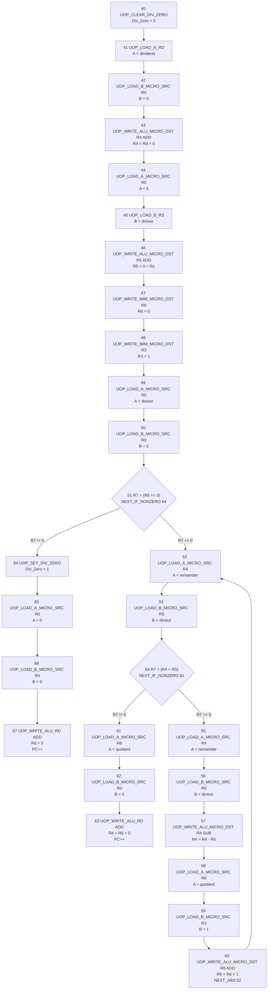

# Microcode UOp Diagrams

These diagrams describe the generic ALU/register-bank microcode used by `MUL` and `DIV`.
Both instructions use `R3`-`R7` as visible scratch registers.

## Multiplication

Scratch convention:

- `R3`: constant `1`
- `R4`: multiplicand copy from original `Rd`
- `R5`: decrementing multiplier copy from `Rs`
- `R6`: running product
- `R7`: compare result

## Division

Scratch convention:

- `R3`: constant `1`
- `R4`: running remainder
- `R5`: divisor copy from `Rs`
- `R6`: running quotient
- `R7`: compare result

